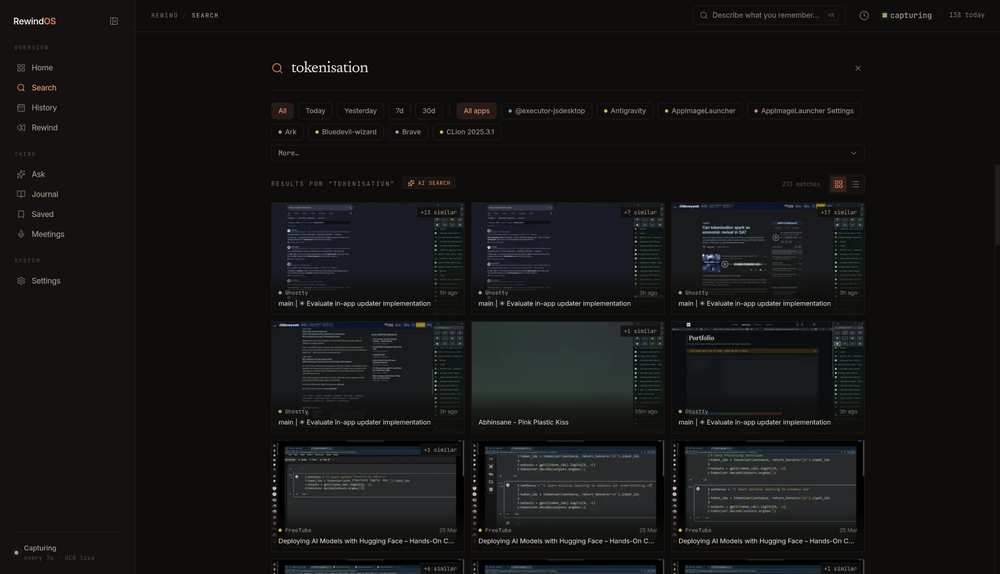
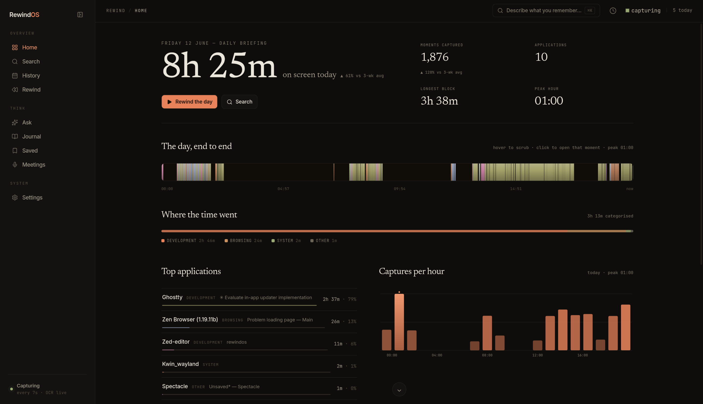
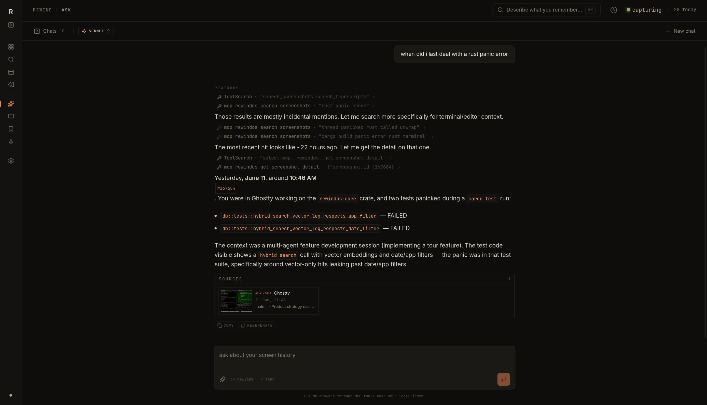
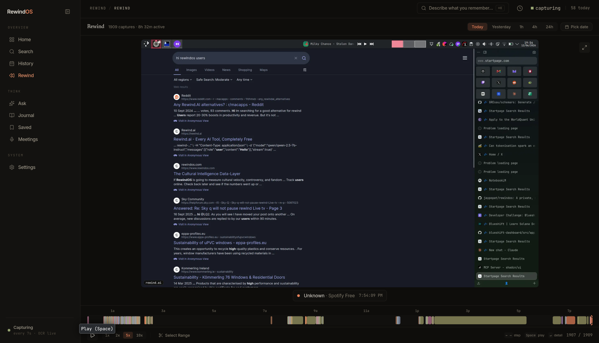
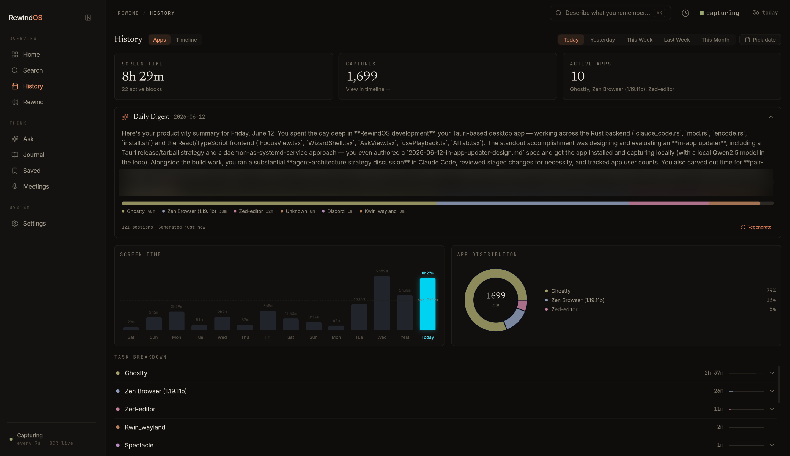

<div align="center">

# RewindOS

### Perfect memory for your Linux desktop.

A private, open-source alternative to **Windows Recall** and **Rewind.ai**. Everything you've ever seen on your screen, instantly searchable — **no cloud, no account, no telemetry, 100% on your machine.**

[](./LICENSE)
[](https://github.com/jaypopat/rewindos/releases/latest)


[](https://github.com/jaypopat/rewindos/stargazers)

</div>

<div align="center">



</div>

<table>
<tr>
<td width="50%">

<p align="center"><sub><b>Home</b> — your day at a glance, with an AI recap</sub></p>
</td>
<td width="50%">

<p align="center"><sub><b>Ask</b> — chat your history with cited screenshots</sub></p>
</td>
</tr>
</table>

## Why RewindOS

- **Truly local.** Capture, OCR, search, and AI all run on your machine. No cloud, no account, no telemetry — it works fully offline.
- **Open source.** MIT-licensed. Read every line, audit what it stores, fork it.
- **Built for Linux.** Native Wayland capture via `xdg-desktop-portal` + PipeWire — works on KDE, GNOME, and wlroots compositors. No competitor ships here.
- **Fast.** SQLite FTS5 gives sub-100ms full-text search across weeks of screen history.

| | RewindOS | Windows Recall | Rewind.ai |
|---|:---:|:---:|:---:|
| Runs locally, no cloud | ✅ | ⚠️ partial | ❌ |
| Open source | ✅ | ❌ | ❌ |
| Linux support | ✅ | ❌ | ❌ |
| No subscription | ✅ | ✅ | ❌ |
| Bring-your-own AI (local or API) | ✅ | ❌ | ❌ |

> Also open source: [omi](https://github.com/BasedHardware/omi) — but macOS-only and cloud-backed. RewindOS stays fully local and Linux-native.

## Features

**🔎 Search & Recall**
Full-text search across everything on your screen in under 100ms. Optional **hybrid search** fuses keyword + semantic results (Ollama embeddings, Reciprocal Rank Fusion). Perceptual hashing skips near-identical frames, and scene grouping keeps results clean.

**🎞️ Browse & Replay**
Scroll your screen history chronologically with hourly grouping, or scrub through it as a **timelapse** with speed controls and keyboard navigation. A **dashboard** surfaces app-usage stats, daily/hourly activity charts, and a heatmap calendar.

**🤖 Ask AI**
Ask questions about your screen history and get answers with **inline citations**, a Sources card, and click-through to the exact screenshots. Backed by **Claude Code** (opus / sonnet / haiku) or local **Ollama** via a per-chat model picker. Pin screenshots as context; copy, regenerate, and follow-up.

**🗂️ Organize**
A rich-text **journal** (Tiptap) with tags, templates, screenshot attachments, and AI summaries. **Bookmarks & collections** to save what matters. **Vault export** writes daily memory notes (journal, recap, meetings, key moments, stats) straight into your Obsidian or Logseq vault.

**🔒 Privacy**
Exclude specific apps or window-title patterns (password managers, private browsing). Global hotkey `Ctrl+Shift+Space` opens search instantly; the app runs quietly in the system tray.

<div align="center">
<table>
<tr>
<td width="50%">

<p align="center"><sub><b>Rewind</b> — replay your day as a timelapse</sub></p>
</td>
<td width="50%">

<p align="center"><sub><b>History</b> — daily digest, app distribution, task breakdown</sub></p>
</td>
</tr>
</table>
</div>

## Install

### Arch Linux <sub>(AUR package coming soon)</sub>

```bash
yay -S rewindos-bin     # or: paru -S rewindos-bin
systemctl --user enable --now rewindos-daemon.service
```

### Other distros

RewindOS is local-first and privacy-focused, so the recommended install is **download, read, then run**:

```bash
curl -fsSL https://raw.githubusercontent.com/jaypopat/rewindos/master/install.sh -o install.sh
less install.sh          # read what it does
bash install.sh
```

Prefer a one-liner? (Same script, run directly.)

```bash
curl -fsSL https://raw.githubusercontent.com/jaypopat/rewindos/master/install.sh | bash
```

The installer detects your distro, installs the system dependencies (Tesseract, PipeWire, the webview, and the right desktop portal), downloads and **checksum-verifies** the latest release, and enables the capture daemon as a systemd user service.

**Options**

```bash
bash install.sh --with-paddleocr   # higher-accuracy OCR (heavier Python deps)
bash install.sh --update           # update to the latest release
bash install.sh --uninstall        # remove RewindOS (asks before deleting your data)
```

**Requirements:** x86_64, a modern Wayland desktop (KDE, GNOME, Hyprland, Sway), and a current distro. The prebuilt binary targets recent glibc + `webkit2gtk-4.1`; on older distros, build from source.

### Optional: AI features

These are off by default; RewindOS works fully without them.

- [Ollama](https://ollama.com) — local semantic search, chat, and journal summaries (everything stays on-device).
- Claude Code CLI — higher-quality chat; once installed and registered with MCP, the Ask view's model picker exposes its tiers (opus / sonnet / haiku).

## How it works

A background daemon captures screenshots every 5 seconds, deduplicates them with perceptual hashing, runs OCR via Tesseract, and indexes the extracted text into SQLite FTS5. A Tauri desktop app provides search, browsing, journaling, and analytics.

```
Timer (5s) → Screen Capture → Hash & Dedupe → OCR → SQLite FTS5
```

## Platform support

Linux on **Wayland**. Capture uses `xdg-desktop-portal` + PipeWire, so it works on any compositor that implements the ScreenCast portal.

| Desktop | Status |
|---|---|
| KDE Plasma 6+ | ✅ Tested |
| GNOME 46+ | ✅ Tested — install the "Window Calls Extended" extension for app/window names |
| Hyprland · Sway · other wlroots | ⚠️ Should work via the portal — not yet verified |

x86_64 only for prebuilt binaries. X11-only sessions aren't supported.

## Usage

After installation, the daemon starts automatically. The UI autostarts minimized to the system tray.

- **Open search**: `Ctrl+Shift+Space`
- **View logs**: `journalctl --user -u rewindos-daemon -f`
- **Restart daemon**: `systemctl --user restart rewindos-daemon`
- **Launch UI manually**: `rewindos`
- **Daemon CLI**: `rewindos-daemon pause | resume | status | backfill`

## Storage

At default settings (~5s interval, 8h/day):

| Metric | Estimate |
|---|---|
| Frames/day (after dedup) | ~2,880 |
| Storage/day | ~210 MB |
| 90-day retention | ~19 GB |

Screenshots are stored as WebP in `~/.rewindos/`. Retention is configurable.

<details>
<summary><b>Build from source</b></summary>

The `install.sh` path above installs system dependencies for you — this section is only if you'd rather build it yourself.

```bash
sudo apt install \
  libpipewire-0.3-dev \
  tesseract-ocr tesseract-ocr-eng \
  libclang-dev libsqlite3-dev \
  libdbus-1-dev pkg-config build-essential
```

Tasks are run with [`just`](https://github.com/casey/just) (`cargo install just`):

```bash
just install
```

This builds the Rust workspace and frontend, installs the daemon as a systemd user service, and sets up the desktop app to autostart minimized to tray on login.

**Manual / dev build**

```bash
cargo build --workspace       # Rust crates
bun install                   # Frontend deps
bun run tauri dev             # Run in dev mode
```

</details>

<details>
<summary><b>Configuration</b></summary>

Config lives at `~/.rewindos/config.toml`. Key options:

- **Capture interval** and change sensitivity threshold
- **Excluded apps** and window title patterns (e.g. password managers, private browsing)
- **Retention period** and storage limits
- **OCR language** and worker count
- **Ollama endpoint** for AI features (semantic search, chat, summaries)
- **App categories** — custom app→category rules for the activity breakdown (Settings → General)

</details>

<details>
<summary><b>Project layout</b></summary>

```
crates/rewindos-core/     Shared lib (DB, OCR, hashing, config, embedding, chat)
crates/rewindos-daemon/   Capture daemon (PipeWire, pipeline, D-Bus, window info)
src-tauri/                Tauri app (commands, D-Bus client, AI chat)
src/                      React frontend
  components/             Reusable UI components (search, charts, shared)
  features/               Feature views (ask, dashboard, history, journal, rewind, saved, settings)
  hooks/                  Custom React hooks
  context/                React context providers
  lib/                    API wrappers, utilities, query keys
docs/                     Architecture & design docs
systemd/                  Service files and desktop entries
```

</details>

## License

MIT
